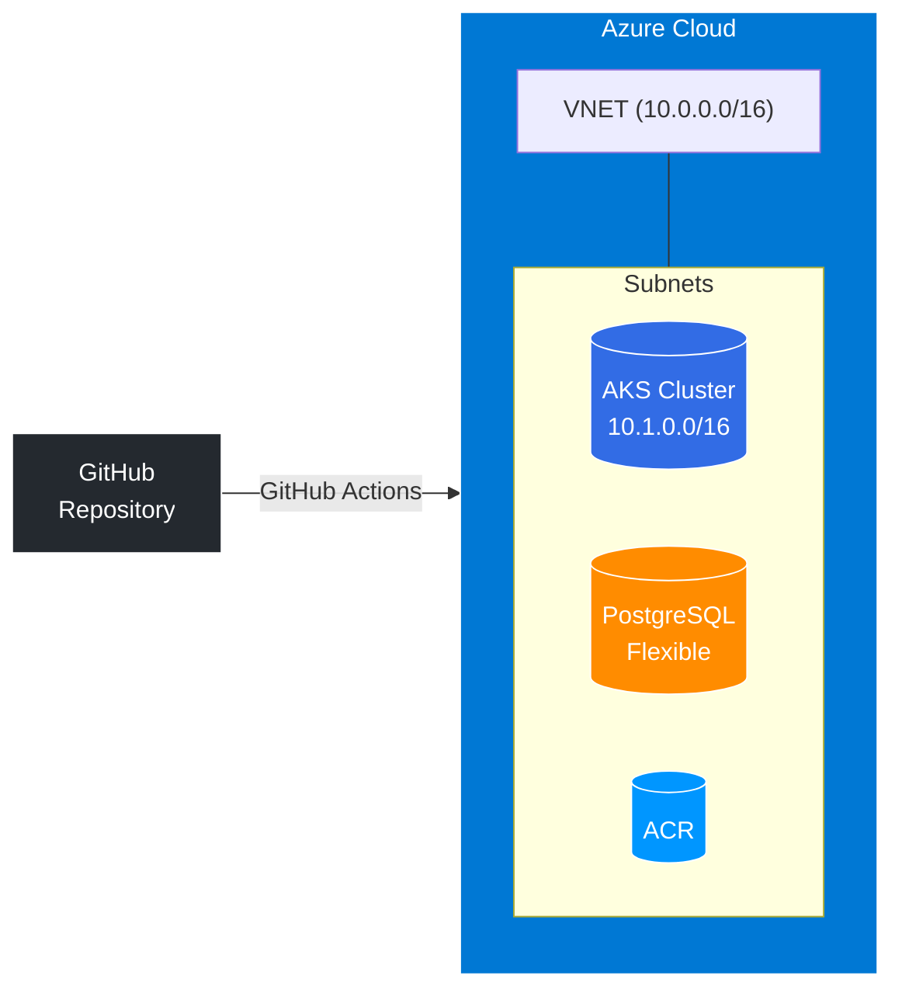

## Présentation

Projet de formation visant à maîtriser le déploiement cloud sur Azure. Cette pipeline automatise le build, le test et le déploiement d'une application FastAPI sur un cluster AKS, avec une infrastructure provisionnée en Terraform.

## Architecture



## Composants

| Ressource | Description |
|-----------|-------------|
| **AKS Cluster** | Azure Kubernetes Service (2 nodes B1s) |
| **PostgreSQL Flexible** | Base de données PostgreSQL v15 avec Private Endpoint |
| **ACR** | Azure Container Registry pour les images Docker |
| **VNET** | Virtual Network 10.0.0.0/16 avec sous-réseaux dédiés |
| **GitHub Actions** | Pipeline CI/CD automatisé |

## Structure

```
kubernetes-azure/
├── app/                 # Application FastAPI + Dockerfile
├── terraform/           # IaC (modules: network, aks, acr, postgres)
├── k8s/                 # Manifests Kubernetes
└── .github/workflows/   # CI/CD Pipeline
```

## Stack Technique

- **Application** : FastAPI + SQLAlchemy + Pydantic
- **Base de données** : PostgreSQL Flexible Server
- **Conteneurisation** : Docker + ACR
- **Orchestration** : Kubernetes (AKS)
- **IaC** : Terraform
- **CI/CD** : GitHub Actions

## Application FastAPI

L'application expose plusieurs endpoints :

```python
# Endpoints disponibles
GET  /                   # Hello World
GET  /hello/{name}      # Message personnalisé
GET  /items             # Liste des items
POST /items             # Créer un item
```

## Déploiement

### 1. Terraform (Infrastructure)

```bash
cd terraform
terraform init
terraform plan
terraform apply
```

### 2. Docker (Build & Push)

```bash
cd app
docker build -t acrjul24.azurecr.io/fastapi-app:latest .
az acr login -n acrjul24
docker push acrjul24.azurecr.io/fastapi-app:latest
```

### 3. Kubernetes (Application)

```bash
az aks get-credentials -g rg-aks-jul24 -n aks-jul24
kubectl apply -f k8s/
```

## Commandes Utiles

```bash
# Vérifier les pods
kubectl get pods -n fastapi-ns

# Logs en temps réel
kubectl logs -n fastapi-ns -l app=fastapi -f

# Accéder au cluster
kubectl exec -it <pod-name> -n fastapi-ns -- /bin/bash
```

## Compétences Acquises

- Azure Kubernetes Service (AKS)
- Terraform modules
- Docker & ACR
- GitHub Actions
- PostgreSQL Flexible Server
- Private Endpoints
- Infrastructure as Code
- CI/CD Pipeline