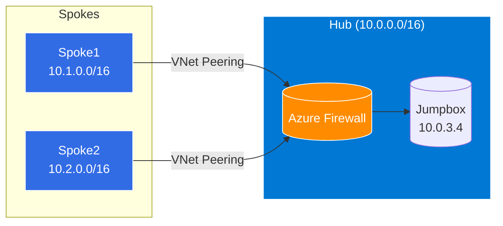

## Présentation

Projet personnel visant à maîtriser les architectures réseau complexes sur Azure. Cette architecture Hub & Spoke démontre comment centraliser la sécurité et l'administration tout en isolant les environnements.

## Architecture



## Composants

| Ressource | Description |
|-----------|-------------|
| **Hub VNET** | 10.0.0.0/16 - Réseau central |
| **Azure Firewall** | Standard SKU avec politique de règles |
| **Jumpbox** | VM Spot Ubuntu 22.04 pour accès admin |
| **Spoke1** | 10.1.0.0/16 - Premier réseau spoke |
| **Spoke2** | 10.2.0.0/16 - Deuxième réseau spoke |
| **Peerings** | Connexions bidirectionnelles hub ↔ spokes |

## Fonctionnalités

- **Hub centralisé** : Point d'entrée unique pour le trafic réseau
- **Azure Firewall** : Filtrage du trafic avec règles réseau et application
- **Jumpbox admin** : Accès sécurisé aux ressources via RDP
- **VNet Peering** : Connexions entre hub et spokes
- **VM Spot** : Optimisation des coûts pour la jumpbox

## Structure Terraform

```
terraform-hub-and-spoke/
├── main.tf                 # Orchestration des modules
├── variables.tf            # Paramètres configurables
├── terraform.tfvars        # Valeurs (location, credentials)
├── provider.tf             # Provider AzureRM
└── modules/
    ├── hub/               # VNET hub, Firewall, Jumpbox
    ├── spoke/             # Spoke 1
    └── spoke2/            # Spoke 2
```

## Commandes

```bash
# Initialiser Terraform
terraform init

# Valider et planifier
terraform validate
terraform plan

# Déployer
terraform apply

# Détruire l'infrastructure
terraform destroy
```

## Compétences Acquises

- Architecture réseau Azure (VNET, Subnets, Peering)
- Azure Firewall configuration
- Terraform modules
- Infrastructure as Code
- Sécurité réseau cloud